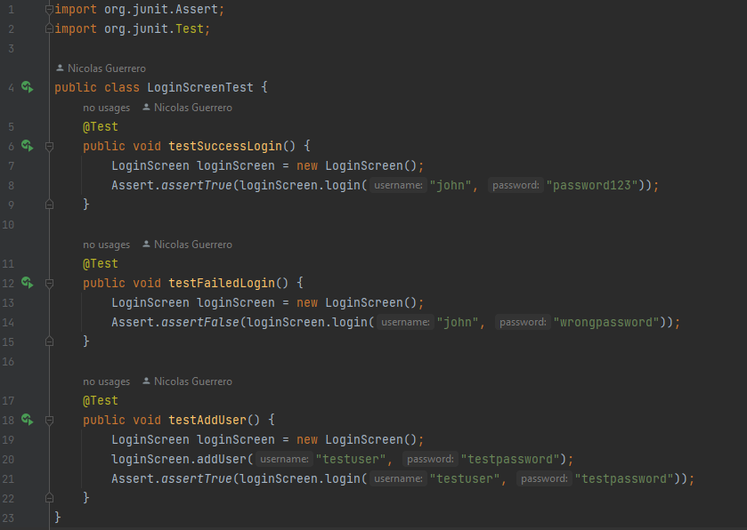
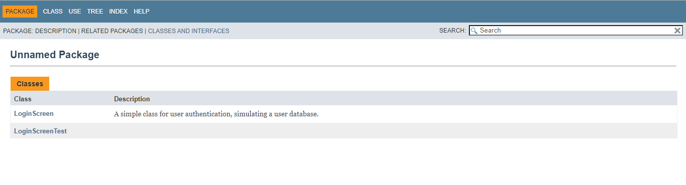
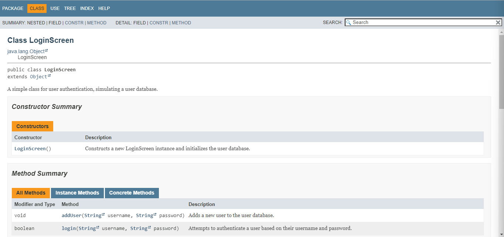

# TDD - Login Screen

## Descrição
Esse repositório consiste em uma atividade para exemplificar o TDD
(Test Driven Development). No projeto há a classe `LoginScreen`, que
representa as funcionalidades de uma tela de login e, 
subsequentemente, a classe `LoginScreenTest`, que possui os testes
unitários para as funcionalidades da classe de login.

Por se tratar de um exercício de TDD, a classe de testes foi 
desenvolvida antes da classe `LoginScreen`, fazendo com que a classe
principal ficasse enxuta e sem funções desnecessárias.

Veja abaixo imagens da classe de teste e da documentação
feita com JavaDoc.

## Última atualização 10/28/23